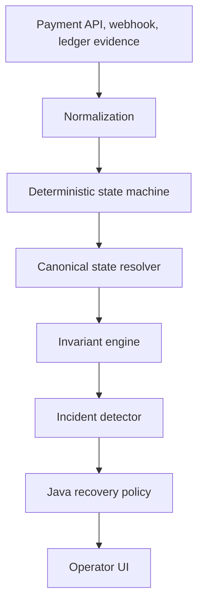

# PayTrace

PayTrace is a local-first payment incident investigation and safe-recovery engine. It reconstructs the financial record across merchant requests, provider events, webhooks, ledger entries, retries, and settlement evidence. The primary system-of-record logic is deterministic; optional intelligence is bounded to assessment and explanation.

## Problem

Payment systems can disagree after a timeout, a retry, duplicate webhooks, delayed delivery, ledger failure, or settlement lag. A merchant-visible timeout does not prove that no money moved. PayTrace preserves evidence, reconstructs a canonical financial state, evaluates financial invariants, and returns a safe recommendation without moving funds.

## How PayTrace Works



## Key Capabilities

- Idempotency keys protect payment creation and concurrent retries.
- A persisted mock provider models response-loss and capture faults without real money movement.
- A webhook inbox retains duplicate-delivery evidence and prevents repeated financial mutation.
- A local double-entry ledger rejects unbalanced journals and uses `BigDecimal` monetary values.
- Controlled simulator scenarios exercise payment ambiguity and recovery behavior.

## Payment State Model

The model includes `CREATED`, `INITIATED`, `AUTHORIZED`, `CAPTURED`, `SETTLED`, `FAILED`, `CANCELLED`, `REVERSED`, `PARTIALLY_REFUNDED`, `REFUNDED`, and `UNKNOWN`. Valid transitions are explicit and tested; regressions such as `SETTLED → AUTHORIZED` are rejected.

## Idempotency

`POST /api/v1/payments` requires an `Idempotency-Key`. A matching payload returns the original logical payment. A different payload on the same key returns a conflict. The local in-process key gate and a persistent unique constraint ensure that concurrent duplicate requests produce one payment, one provider capture, and one ledger transaction in the local single-node deployment.

## Webhook Processing

Provider webhooks are validated, persisted in the inbox, checked against stable provider event IDs, normalized, and then applied to the event stream. A duplicate is retained as evidence but does not reapply the financial event again.

## Ledger Integrity

A capture posts Gateway Clearing debit and Customer Receivable credit. The ledger validates equal debit and credit totals before persisting a journal.

## Incident Investigation

Investigations return the canonical payment state, timestamped timeline, invariant results, incident classes, bounded decision assessment, and authoritative recovery recommendation.

## Safe Recovery

PayTrace never executes a refund, reversal, or external financial operation. It only emits a recommendation. Capture evidence drives `DO_NOT_RETRY`; non-financial terminal failure evidence can drive `RETRY_SAFE`; incomplete evidence drives provider re-query.

## Decision Intelligence

`DecisionIntelligencePort` is a narrow boundary for a Jev adapter. The local deterministic stub is the default. `ExplanationModelPort` provides an offline evidence summary; a Spring AI OpenAI adapter can be enabled only when credentials are supplied. Neither boundary decides financial state transitions or recovery policy.

## Technology Stack

- Java 21 (the runtime available in the supplied Windows environment), Spring Boot, Spring Data JPA, H2 file persistence, Flyway, Maven
- Spring AI dependency boundary for OpenAI explanation integration
- Next.js, TypeScript, Tailwind CSS, React Flow, Lucide

## Local Setup

Use Java 21 or newer and Maven 3.9 or newer. Java 27 source compatibility is avoided because the provided runtime exposes Java 21; no preview features are used.

```powershell
Copy-Item .env.example .env
.\scripts\start-local.ps1
```

The frontend opens at `http://localhost:3000`; the backend runs at `http://localhost:8080`.

## Running the Simulator

Open the operator UI and select **Launch timeout-after-capture**. The scenario records a provider capture with a merchant timeout; the client retry is treated as an idempotency replay. The investigation resolves the payment to `CAPTURED` and recommends `DO_NOT_RETRY`.

## API Overview

| Area | Endpoints |
| --- | --- |
| Payments | `POST /api/v1/payments`, `GET /api/v1/payments`, `GET /api/v1/payments/{id}` |
| Investigation | `POST /api/v1/payments/{id}/investigate`, timeline, integrity, recovery reads |
| Webhooks | `POST /api/v1/webhooks/provider` |
| Simulator | `GET /api/v1/simulator/scenarios`, `POST /api/v1/simulator/runs?scenario=…` |
| Operations | `GET /api/v1/health` |

## Evaluation

Scenario fixtures specify their expected canonical state, incident class, invariant behavior, and recovery action. The test suite includes state transitions, chronological reconstruction, ledger balance rejection, idempotency conflicts, and a 20-request virtual-thread concurrency exercise.

## Security Model

The service accepts synthetic data only. It validates API payloads, bounds webhook payload text, uses decimal currency values, keeps secrets in local environment variables, and does not expose secrets to the browser. It does not connect to real payment networks or perform money movement.

## Repository Structure

`backend/` contains the Spring application, migrations, and tests. `frontend/` contains the Next.js operator interface. `docs/` holds the architecture and operating model; `scripts/` contains Windows and Unix commands.

## Contributing

Use focused changes with accompanying tests. Preserve deterministic ownership of financial state and recovery policy.

## License

MIT. See [LICENSE](LICENSE).
